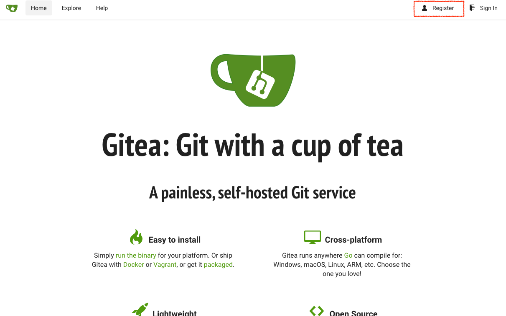
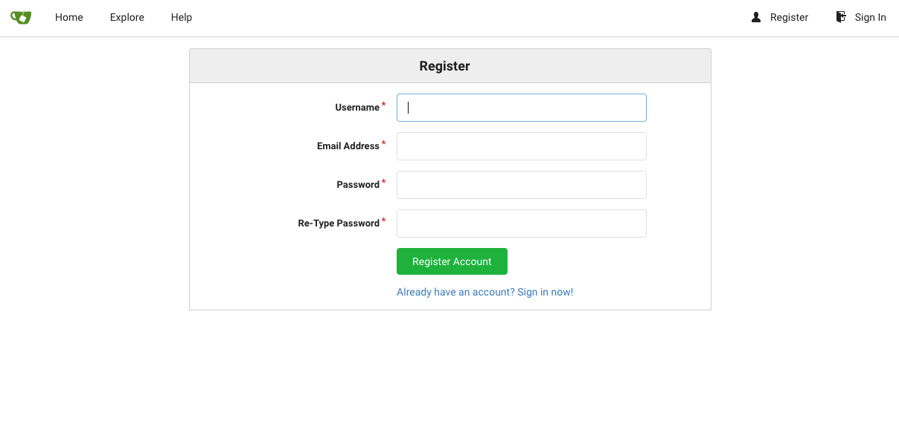
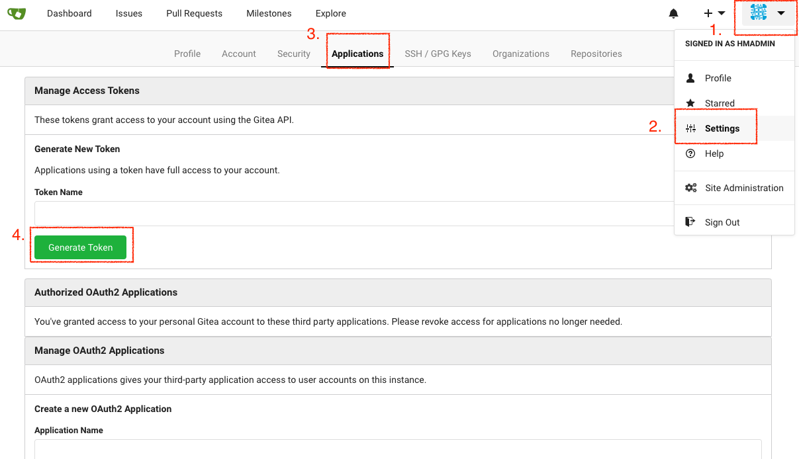
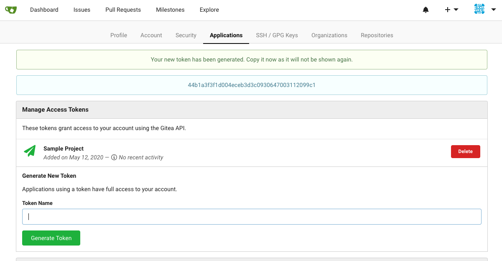
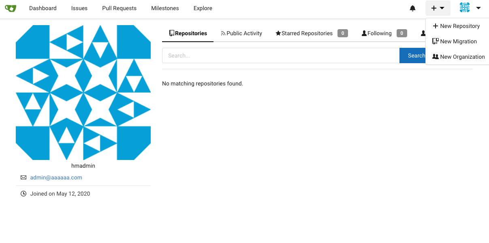
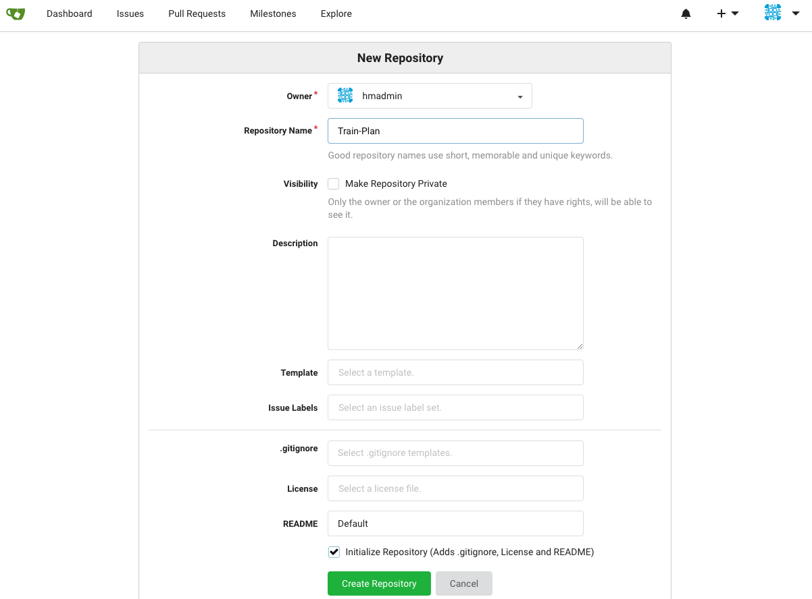
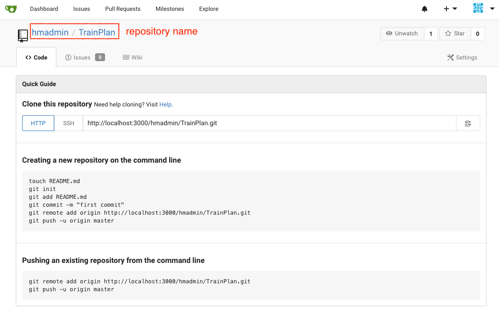
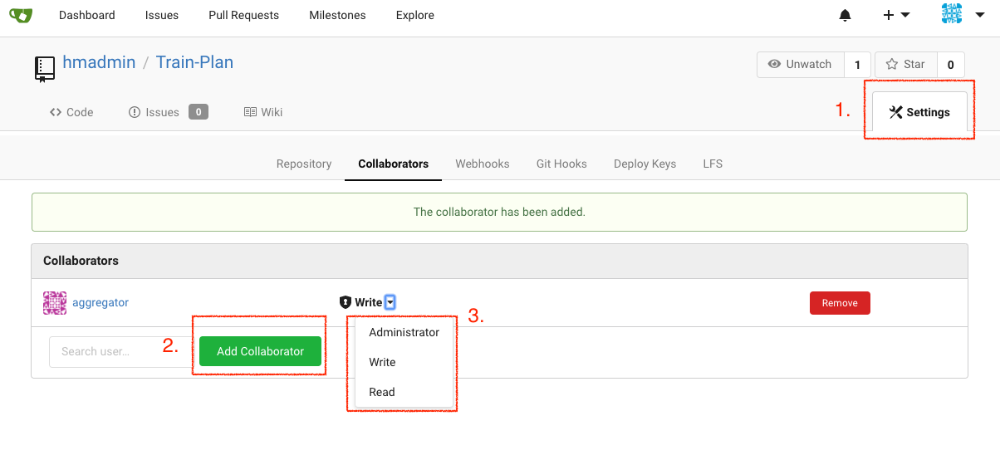
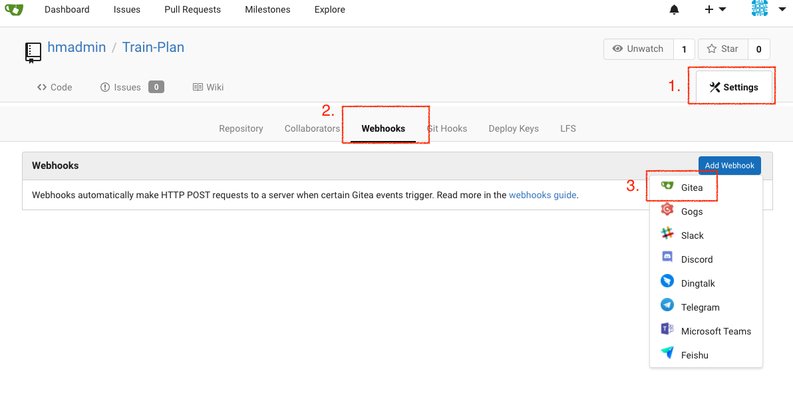
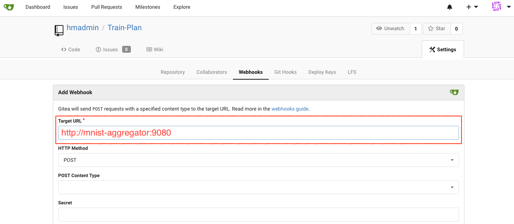

# FL Project Setup

This chapter shows how to setup a 2-edge FL Harmonia environment. There are 3 accounts and repositoreis for each participant(`aggregator`, `edge1`, `edge2`) and another repository `Train-Plan` to be created. Relations between entities would be created in this chapter. All these operations are demonstrated by Gitea GUI. For automation demand, all operations are covered in [Gitea APIs](https://docs.gitea.io/en-us/api-usage/) and [try it](https://try.gitea.io/api/swagger).

1. Create or register Gitea accounts representing each participants of FL, `aggregator`, `edge1`, `edge2`

2. For security, we strongly recommend to use application token instead of user password in operator configurations mentioned in [chapter 4](./ch4-execute-learning.md). To generate tokens:

3. Create repositories `Train-Plan`, `Aggregated-Model`, `Edge1-Model`, `Edge2-Model`.

4. Setup permissions of each repositories.
    |Repository |`aggregator`   |`edge1`    |`edge2`|
    |---                |---    |---        |---    |
    |Train-Plan         |Read   |Read       |Read   |
    |Aggregated-Model   |Write  |Read       |Read   |
    |Edge1-Model        |Read   |Write      |None   |
    |Edge2-Model        |Read   |None       |Write  |

5. Setup webhooks of each repositories. In k8s, value of `Target URL` could be the service name of a pod or deployment, i.e. `metadata.name` field in `Service` object. This would be set in [chapter 3](./ch3-k8s-deployment.md).  
For instance, changes of `Edge1-Model` should be aware or listened by `aggregator` pod, so a `Edge1-Model` webhook should be created in order to notify aggregator what the repository updates. The target URL should be filled with `http://mnist-aggregator:9080` in this example.

Here is the webhook setup list:
|Repository         |Webhooks(Target URL)   |
|---                |---                    |
|Aggregated-Model   |`http://mnist-edge1:9080` `http://mnist-edge2:9080`|
|Edge1-Model        |`http://mnist-aggregator:9080`|
|Edge2-Model        |`http://mnist-aggregator:9080`|
|Train-Plan         |`http://mnist-aggregator:9080` `http://mnist-edge1:9080` `http://mnist-edge2:9080`|
